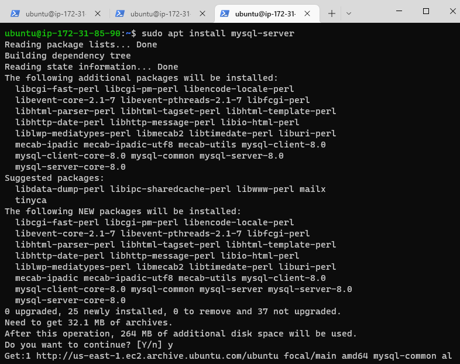
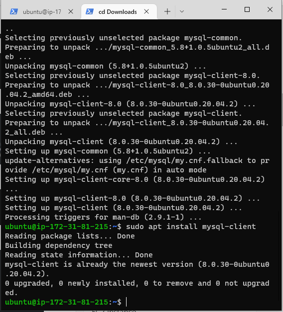
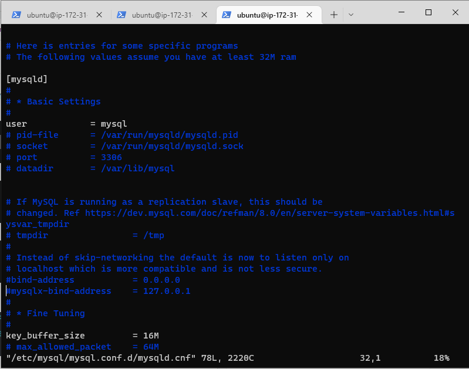
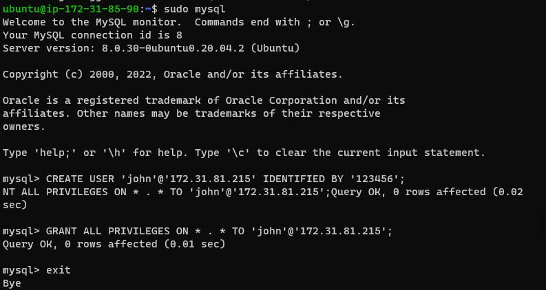
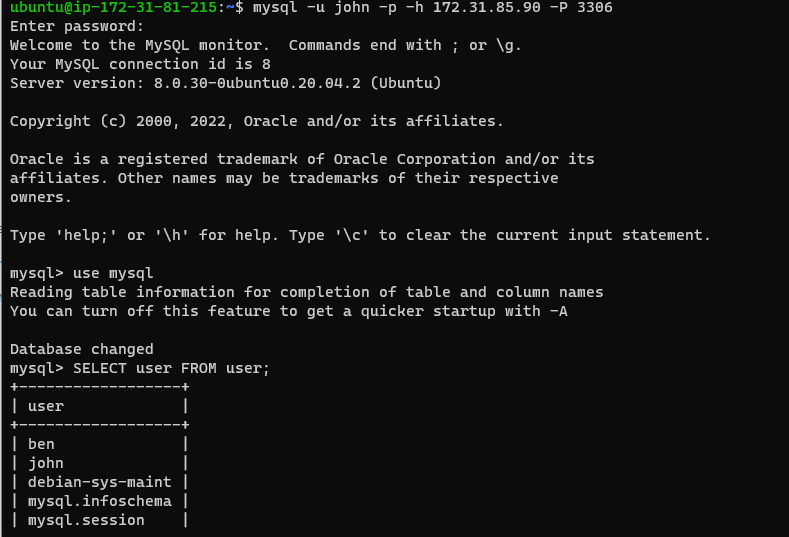

## In this project i will Implement a Client Server Architecture using MySQL Database Management System (DBMS)

Create and configure two Linux-based virtual servers (EC2 instances in AWS) with names

```
Server A name - `mysql server`
Server B name - `mysql client`
```

On mysql server Linux Server install MySQL Server software

`sudo apt install mysql-server`



On mysql client Linux Server install MySQL Client software

`sudo apt install mysql-client`



By default, both of your EC2 virtual servers are located in the same local virtual network, so they can communicate to each other using local IP addresses. Use mysql server's local IP address to connect from mysql client. MySQL server uses TCP port 3306 by default, so you will have to open it by creating a new entry in ‘Inbound rules’ in ‘mysql server’ Security Groups. For extra security, do not allow all IP addresses to reach your ‘mysql server’ – allow access only to the specific local IP address of your ‘mysql client’.

In your mysql-server ec2 instance allow the ipaddress of the mysql-client ec2 instance with port 3306 to access the mysql-server ec2 instance


You might need to configure MySQL server to allow connections from remote hosts

`sudo vim /etc/mysql/mysql.conf.d/mysqld.cnf`

and comment out both binding address




On your mysql-server create a new user using the following code

`CREATE USER 'john'@'172.31.81.215' IDENTIFIED BY '123456';
GRANT ALL PRIVILEGES ON * . * TO 'john'@'172.31.81.215';`

Note: '172.31.81.215' is the ipaddress of your mysql-client



To connect to the mysql server, in your mysql client enter the following code

`mysql -u john -p -h 172.31.85.90 -P 3306`

Enter your password



Test some mysql commnds.

## Congrtultions.